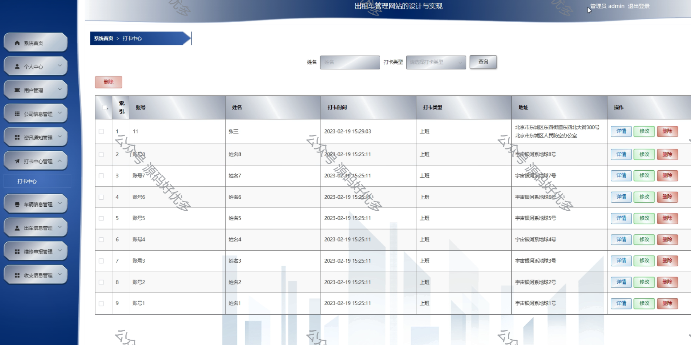

 
## 查看主页获取源码

> **作者介绍**： **✌**全网粉丝10W+本平台特邀作者、博客专家、CSDN新星计划导师、java领域优质创作者,博客之星、掘金/华为云/阿里云/InfoQ等平台优质作者、专注于项目实战 **✌**

  

### 一、作品包含

源码+数据库+设计文档万字+PPT+全套环境和工具资源+部署教程

### 二、项目技术

前端技术：Html、Css、Js、Vue、Element-ui

数据库：MySQL

后端技术：Java、Spring Boot、MyBatis

  

### 三、运行环境

开发工具：IDEA/eclipse

数据库：MySQL5.7

数据库管理工具：Navicat10以上版本

环境配置软件： JDK1.8+Maven3.6.3

前端Nodejs：14

### 四、项目介绍
项目编号：springbootA119

出租车管理网站旨在为城市交通管理部门和出租车运营企业提供一个高效的在线服务平台，提升出租车行业的服务质量，优化运营效率，确保乘客安全，同时便于监管部门进行行业管理和决策支持，推动出租车行业的健康有序发展。

系统分为管理员、用户、公司
管理员的功能：系统首页、个人中心、用户管理、公司信息管理、资讯通知管理、打卡中心管理、车辆信息管理、出车信息管理、维修申报管理、收支信息管理。
用户的功能：系统首页、个人中心、资讯通知管理、打卡中心管理、车辆信息管理、出车信息管理和维修申报管理。
公司的功能：系统首页、个人中心、用户管理、公司信息管理、资讯通知管理、打卡中心管理、车辆信息管理、出车信息管理、维修申报管理、收支信息管理。
### 五、运行截图

  
